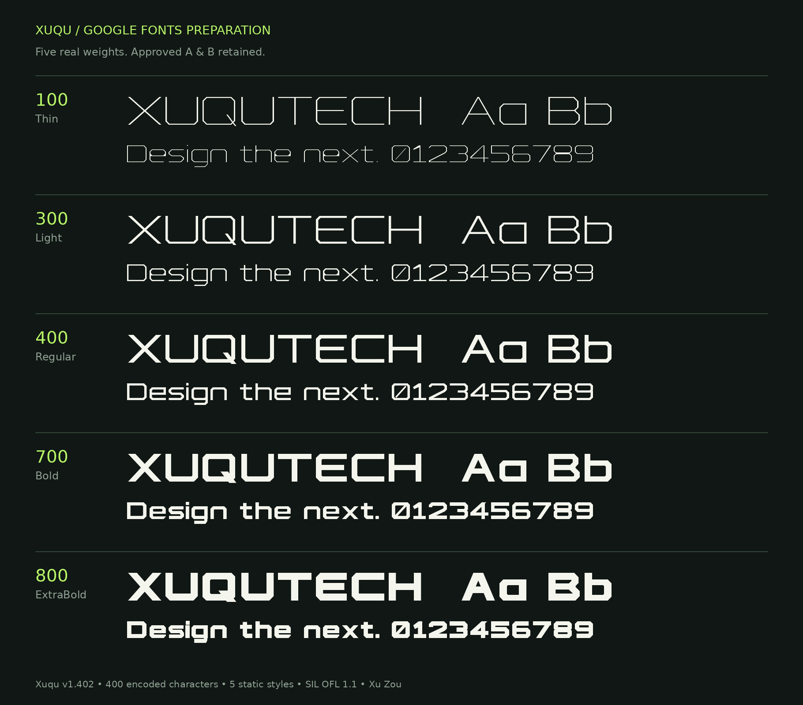

# Xuqu

Xuqu is a wide geometric Latin display family developed from the XUQU Tech
wordmark, with angular joins, cut corners and open geometric forms. Its five
upright weights are intended for branding, posters, video titles and short
display text. Thin and Light are best suited to larger sizes.

**Version 1.402 · SIL Open Font License 1.1 · Copyright holder: Xu Zou (邹旭)**

[中文说明](README.zh-CN.md) · [QA report](documentation/QA-SUMMARY.md) ·
[Design provenance](documentation/PROVENANCE.md) · [OFL](OFL.txt)



## Fonts

| Style | Weight | Desktop font |
|---|---:|---|
| Thin | 100 | [Xuqu-Thin.ttf](fonts/ttf/Xuqu-Thin.ttf) |
| Light | 300 | [Xuqu-Light.ttf](fonts/ttf/Xuqu-Light.ttf) |
| Regular | 400 | [Xuqu-Regular.ttf](fonts/ttf/Xuqu-Regular.ttf) |
| Bold | 700 | [Xuqu-Bold.ttf](fonts/ttf/Xuqu-Bold.ttf) |
| ExtraBold | 800 | [Xuqu-ExtraBold.ttf](fonts/ttf/Xuqu-ExtraBold.ttf) |

Install the TTF files and select **Xuqu** in your font menu. Corresponding WOFF2
files are in `fonts/webfonts/`; `webfont.css` defines the five real CSS weights
and disables synthetic weight generation.

Each style contains **400 encoded Unicode characters and 416 glyphs**. All 319
encoded entries and five required unencoded entries in the pinned GF Latin Core
list are supplied. Coverage includes Latin-1, Latin Extended-A, selected additional
Latin letters, figures, punctuation, combining marks and symbols. There are no
Chinese glyphs, italics or variable-font axes.

OpenType features include kerning (`kern`), combining marks (`mark`, `mkmk`),
contextual dot removal (`ccmp`), Catalan/Turkish/Azeri locale behavior (`locl`) and
tabular figures (`tnum`). The default figure 1 has proportional spacing.

## Build from source

Python 3.12 was used for this release candidate. From the repository root:

```sh
python3 -m venv .venv
. .venv/bin/activate
python -m pip install -r requirements.txt
python scripts/build.py
python scripts/validate.py
```

The equivalent shell entry point is `bash sources/build.sh`. fontmake compiles
the five editable UFO sources into static TTF and WOFF2 files. Sources include
geometry, kerning, anchors and feature code. This display family is deliberately
unhinted and uses GASP 0x000A, as described in the [Google Fonts static-font
guide](https://googlefonts.github.io/gf-guide/statics).

For everyday editing, modify the UFO sources. `scripts/export_sources.py` is an
initial importer from the approved v1.3 references; `--overwrite` replaces later
design edits and must not be used as a normal build step. Original vector
generation code is retained under `sources/legacy/` for provenance.

## Validation

The current local regression passes: approved A/B geometry, original coverage,
weight progression, FreeType rasterization, representative HarfBuzz shaping,
tabular figures and TTF/WOFF2 equivalence. All non-metadata font tables match
v1.401 exactly. Rebuilding the committed UFOs reproduces all ten output hashes.

Install [Fontspector](https://github.com/fonttools/fontspector/blob/main/INSTALLATION.md)
separately. This release candidate used version **1.7.4**:

```sh
python scripts/run_qa.py --fontspector fontspector
```

The full Google Fonts profile runs **offline**, with the actual OFL.txt supplied
as an input and no excluded check IDs. Result: **467 PASS, 51 WARN, 0 FAIL,
0 ERROR/FATAL, 32 INFO, 303 SKIP**. Warnings are individually discussed in the
[QA report](documentation/QA-SUMMARY.md); skipped checks are not passes. Network
Fontspector checks remain skipped. A separate live [Xuqu name lookup](https://namecheck.fontdata.com/?q=Xuqu) on 2026-09-13 found no exact-name match; Windows/macOS/Adobe/Figma GUI acceptance has not been completed.
Google Fonts acceptance is a separate review and is not claimed here.

## License and ownership

The complete existing and future Xuqu family is licensed under **SIL OFL 1.1**,
with no Reserved Font Names. See [OFL.txt](OFL.txt) and [AUTHORS.txt](AUTHORS.txt).
The copyright header in the license and all current font files is:

`Copyright 2026 The Xuqu Project Authors (https://github.com/uxbillzou/xuqu-font)`

The personal copyright holder is **Xu Zou (邹旭)**. The project was developed with
AI-assisted custom font engineering; that process is explicitly documented in
the provenance notes. Historical v1.3 reference fonts are preserved byte-for-byte
for regression and are covered by the same family-wide OFL decision. External
tools and glyphset data retain their own licenses.

The owner reports submitting the Google Individual CLA and supplied the
submission-success screen. Google’s contribution-account matching has not yet
been independently checked. The private CLA screenshot is not part of this repo.
The owner has confirmed ongoing maintenance and public submission. The name lookup
found no exact match. The GitHub integration returned 403 when creating the
google/fonts issue, so **the request has not been sent**. The final body and
[ready-to-open submission form](review/SUBMIT-TO-GOOGLE-FONTS.md) are saved under `review/`.

## Contact

Xu Zou / 邹旭（序曲） · XUQU Tech  
Email: **zouxu@xuqutech.com**  
WeChat: **w86166569**  
Project: [uxbillzou/xuqu-font](https://github.com/uxbillzou/xuqu-font)

No WeChat QR image is included. The contact email follows the public contact
section of the owner’s company website source.
